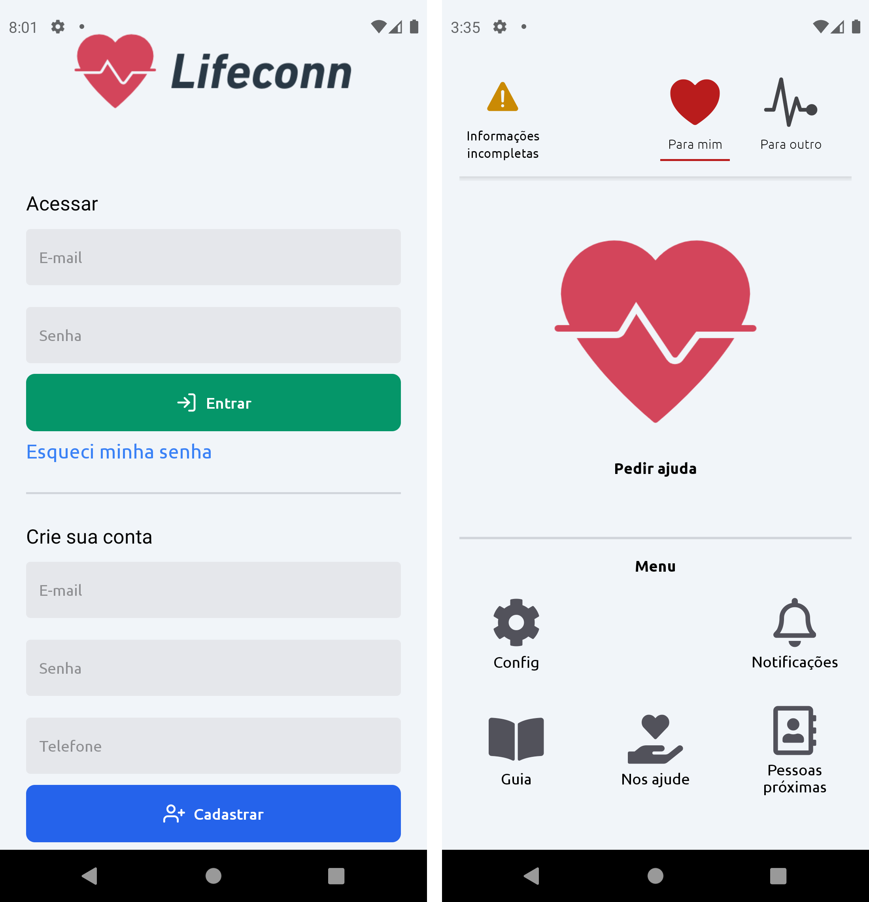

<h1 align="center" >
    
</h1>

<h3 align="center">
  Lifeconn: uma aplicação para auxílio no atendimento emergencial
</h3>

<p align="center">
  <a href="#dart-projeto">Projeto</a>&nbsp;&nbsp;&nbsp;|&nbsp;&nbsp;&nbsp;
  <a href="#mag-tecnologias">Tecnologias</a>&nbsp;&nbsp;&nbsp;|&nbsp;&nbsp;&nbsp;
    <a href="#information_source-como-usar">Como Usar</a>&nbsp;&nbsp;&nbsp;|&nbsp;&nbsp;&nbsp;
  <a href="#memo-licença">Licença</a>
</p>


<p align="center">
  
  
</p>    

<p align="center" >
  
  
</p>  

## :dart: Projeto
Trabalho de conclusão de curso realizado junto ao Centro Federal de Educação Tecnológica Celso Suckow da Fonseca (CEFET) do Rio de Janeiro - Campus Nova Friburgo, com o objetivo de desenvolver uma aplicação para auxílio no atendimento emergencial.

 Acionar socorro rapidamente e fornecer informações precisas podem ser o diferencial para o desfecho de um acidente. Utilizar uma solução de software para essa finalidade pode não somente auxiliar a vítima, mas quem precisa prestar o atendimento de uma ocorrência. Este trabalho apresenta uma solução composta por um aplicativo e um sistema web para apoiar a prestação de socorro em caso de acidentes. Seus requisitos foram validados junto ao Corpo de Bombeiros de Nova Friburgo e suas funcionalidades foram comparadas com soluções do mercado, visando maximizar o número de funcionalidades relevantes para a prestação de ajuda. 

##### Metodologias e Designs
  - TDD
  - Clean Architecture
  - DDD
  - Refactoring
  - Modular Design
  - Use Cases
  
##### Design Patterns
  - Factory
  - Adapter
  - Composite
  - Dependency Injection
  - Composition Root
  - Builder
  - Chain of Responsibility
 
 ##### Funcionalidades
 - Coleta de informações acidente
 - Cadastro de informações médicas do usuário
 - Acionamento de socorro
 - Notificação de familiares
 - Guia de primeiros socorros e mecânica básica
 - Chat real-time e envio de fotos para prestadores de socorros

Para mais informações, leia a [monografia](.github/lifeconn-monografia.pdf).

## :mag: Tecnologias
-  [Typescript](https://www.typescriptlang.org/)
-  [Expo](https://expo.io/)
-  [React-Native](https://facebook.github.io/react-native/)
-  [Firebase](https://firebase.google.com/?hl=pt)
-  [Docker](https://www.docker.com/)
-  [Tailwind](https://tailwindcss.com/)

## :information_source: Como Usar

```bash
# Adicione as configurações do firebase no arquivo .env
# Instale as dependências
$ yarn 
# ou
$ npm i
# Inicie o expo
$ yarn start
# ou
$ npm start
```

## :memo: Licença
Para informações sobre [LICENÇA](https://github.com/ainertec-developer/sisvep/blob/master/license.txt)

---
Feito com :heart:

